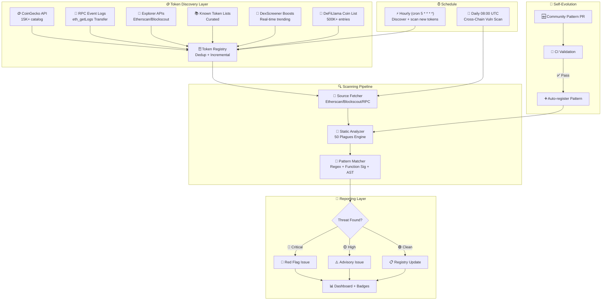

# 👁️⚖️ MaatEye — The Eternal Guardian of Smart Contracts

<p align="center">
  
  
  
  
  
  
  
  <br>
  
  
  
  
  
</p>

<p align="center">
  <b>🏛️ Named after Ma'at (ماعت)</b> — the ancient Egyptian goddess of truth, balance, and justice.<br>
  <i>"She who weighs the heart against the feather."</i>
</p>

<p align="center">
  <a href="https://lord1egypt.github.io/MaatEye/">
    
  </a>
</p>

---

## 🚀 Vision

**MaatEye** is an open-source, community-driven **smart contract vulnerability scanner** that automatically detects **50 dangerous patterns** across **55 configured EVM chains** (15 currently populated), tracking **~6,500 discovered tokens** in a persistent registry — sourced from CoinGecko (15K+ token catalog) + RPC event logs + explorer APIs + DexScreener + DeFiLlama.

> Not a pentest tool. Not an exploit kit.  
> **A guardian that watches, warns, and protects.**

### 🔥 What makes MaatEye different?

| Feature | MaatEye | Others |
|---------|---------|--------|
| 🆓 **100% Free** (runs on GitHub Actions) | ✅ | ❌ Paid APIs ($100+/mo) |
| 🌐 **Mass Token Discovery** (6 sources, 15K+ catalog) | ✅ CoinGecko + RPC logs | ❌ Top 50 only |
| 🔄 **Self-updating** (new patterns auto-deploy) | ✅ | ❌ Manual updates |
| 🚩 **Live Red Flag registry** (public Issues) | ✅ | ❌ Private DB |
| 🧩 **Community patterns** (anyone can PR) | ✅ | ❌ Closed source |
| 🔍 **Multiple discovery sources** | ✅ 6 sources combined | ❌ 1-2 sources |
| 🗄️ **Persistent token store** (dedup, incremental) | ✅ | ❌ Stateless |

---

## 🪙 Token Discovery — 6 Sources Combined

MaatEye doesn't just scan "top 30" tokens — it discovers **everything** across **6 combined sources**.

### Source 1: 🪙 CoinGecko API (PRIMARY)
| Detail | Value |
|--------|-------|
| Coverage | **15,000+ tokens** across 100+ chains |
| Endpoint | `api.coingecko.com/api/v3/coins/list?include_platform=true` |
| Cost | Free (no API key required) |
| Chains | Ethereum, BSC, Polygon, Arbitrum, Optimism, Base, Avalanche, +14 more |

### Source 2: 🧾 RPC Event Logs (REAL-TIME)
| Detail | Value |
|--------|-------|
| Method | `eth_getLogs` → `Transfer(address,address,uint256)` events |
| Coverage | Any ERC20/ERC721 that ever emitted a Transfer |
| Granularity | Block-by-block, real-time discovery |
| Dedup | Automatically merged with other sources |

### Source 3: 🔭 Explorer APIs (VERIFIED)
| Detail | Value |
|--------|-------|
| Coverage | Top 50 verified contracts per chain |
| APIs | Etherscan-compatible + Blockscout |
| Source | Verified source code directly |

### Source 4: 📚 Known Token Lists (CURATED)

| Detail | Value |
|--------|-------|
| Coverage | 10-18 major tokens per chain |
| Purpose | Seed registry for low-activity chains |
| Maintenance | Updated via PRs |

### Source 5: 🦎 DexScreener Boosts (REAL-TIME)

| Detail | Value |
|--------|-------|
| Endpoint | `api.dexscreener.com/token-boosts/latest/v1` |
| Coverage | Newly boosted/trending tokens across **all chains** |
| Cost | Free (no API key required) |
| Advantage | Catches tokens before CoinGecko — new launches, memecoins, low-cap |

### Source 6: 🦙 DeFiLlama Coin List (COMPREHENSIVE)

| Detail | Value |
|--------|-------|
| Endpoint | `coins.llama.fi/list` |
| Coverage | **500K+ entries** across 100+ chains |
| Cost | Free (no API key required) |
| Advantage | Broader than CoinGecko for newer/L2 chains |

### 🗄️ Persistent Token Store

All discovered tokens are stored in a **deduplicated JSON registry**:

```
📁 data/token_registry.json
├── 🔑 chain + address (primary key, guaranteed unique)
├── 📝 symbol, name, decimals (enriched via eth_call)
├� 📅 discovered_at, last_scanned, scan_count
├── 🔍 has_source, vuln_count, max_severity
└── 🔗 source (coingecko/rpc/explorer/known)
```

**Incremental only** — new discoveries add to existing data, never duplicate.

---

## 📋 The 50 Plagues — Detection Patterns

> *"I will bring the plagues upon the unsafe contracts, and they shall be exposed."*

MaatEye ships **50 detection patterns** (`scanner/patterns/P*.yaml`) organized into **10 vulnerability categories**. Each pattern is a regex / function-signature / lightweight-AST rule with a severity and a YAML definition you can read and extend.

**Severity legend:** 🔴 Critical · 🟡 High · 🟠 Medium

### 🔐 Access Control (9)
| Pattern | Severity |
|---------|----------|
| P01 — Unprotected Mint | 🔴 |
| P02 — Selfdestruct Anyone | 🔴 |
| P21 — Unprotected Initializer | 🔴 |
| P22 — Role Admin Hijack | 🔴 |
| P05 — tx.origin Authentication | 🟡 |
| P18 — Missing Access Control | 🟡 |
| P23 — Ownership Transfer Without Two-Step | 🟡 |
| P24 — Pausable Without Unpause Guard | 🟡 |
| P14 — Unsafe Ownership Renounce | 🟠 |

### 🔄 Reentrancy (8)
| Pattern | Severity |
|---------|----------|
| P03 — Reentrancy | 🔴 |
| P25 — Cross-Function Reentrancy | 🔴 |
| P27 — Cross-Contract Reentrancy | 🔴 |
| P28 — ERC721 Callback Reentrancy | 🔴 |
| P29 — ERC1155 Batch Reentrancy | 🔴 |
| P31 — Flash Loan Reentrancy Bridge | 🔴 |
| P26 — Read-Only Reentrancy | 🟡 |
| P30 — Reentrancy Via Fallback | 🟡 |

### 📞 External Calls (8)
| Pattern | Severity |
|---------|----------|
| P07 — Delegatecall Injection | 🔴 |
| P17 — Arbitrary External Call | 🔴 |
| P43 — Delegatecall to Untrusted Library | 🔴 |
| P06 — Unchecked Call | 🟡 |
| P41 — Contract Existence Check Missing | 🟡 |
| P45 — CREATE2 Address Collision | 🟡 |
| P42 — Gas Stipend Dependency | 🟠 |
| P44 — Staticcall With Side Effects | 🟠 |

### 🧩 Proxy / Upgradeable (7)
| Pattern | Severity |
|---------|----------|
| P16 — Uninitialized Proxy | 🔴 |
| P36 — Metamorphic Contract (selfdestruct + CREATE2) | 🔴 |
| P37 — Implementation Selfdestruct | 🔴 |
| P08 — Storage Collision | 🟡 |
| P38 — Constructor in Implementation | 🟡 |
| P39 — Function Clashing | 🟡 |
| P40 — UUPS Without Upgrade Guard | 🟡 |

### 📐 Arithmetic (5)
| Pattern | Severity |
|---------|----------|
| P04 — Integer Overflow/Underflow | 🔴 |
| P35 — Share Price Manipulation (EIP-4626) | 🔴 |
| P32 — Precision Loss (Division Before Multiplication) | 🟡 |
| P33 — Rounding in Favor of Wrong Party | 🟡 |
| P34 — Fee Calculation Exploit | 🟡 |

### 🪙 Token Economics (5)
| Pattern | Severity |
|---------|----------|
| P10 — Oracle Manipulation | 🔴 |
| P11 — Flash Loan Attack Vector | 🟡 |
| P50 — Honeypot Detection | 🟡 |
| P51 — Fee-On-Transfer Accounting Mismatch | 🟡 |
| P52 — Deflationary Token Balance Change | 🟡 |

### 🗳️ Governance (3)
| Pattern | Severity |
|---------|----------|
| P13 — Governance Attack | 🔴 |
| P60 — Flash Loan Governance Takeover | 🔴 |
| P61 — Low Quorum / Low Proposal Threshold | 🟡 |

### 🧠 Business Logic (3)
| Pattern | Severity |
|---------|----------|
| P09 — No Input Validation | 🟡 |
| P15 — Incorrect Visibility | 🟠 |
| P20 — Timestamp Dependence | 🟠 |

### ✍️ Signature / Crypto (1)
| Pattern | Severity |
|---------|----------|
| P12 — Signature Replay (EIP-712 without nonce/chainId) | 🟡 |

### 🛡️ ERC Standards (1)
| Pattern | Severity |
|---------|----------|
| P19 — No SafeERC20 | 🟠 |

> The live dashboard renders the full pattern catalog with categories and severity counts: **[lord1egypt.github.io/MaatEye](https://lord1egypt.github.io/MaatEye/)**

---

## 🏗️ Architecture



### Data Flow

```
User / Time Trigger
       │
       ▼
┌──────────────────────┐     ┌────────────────────┐     ┌──────────────────┐
│  Token Discovery     │────▶│  Token Registry    │────▶│  Scan Engine     │
│  (6 sources, dedup)  │     │  (persistent JSON) │     │  (50 patterns)   │
└──────────────────────┘     └────────────────────┘     └──────────────────┘
                                                               │
                                                               ▼
┌──────────────────────┐     ┌────────────────────┐     ┌──────────────────┐
│  Update README       │◀────│  Create GitHub     │◀────│  Classify        │
│  + Registry          │     │  Issue (if vuln)   │     │  Severity        │
└──────────────────────┘     └────────────────────┘     └──────────────────┘
```

---

## 🚦 Quick Start

### 1. Submit a Contract

Open a [Contract Submission Issue](https://github.com/Lord1Egypt/MaatEye/issues/new?template=submit_contract.yml) with the contract address.

### 2. Run Locally

```bash
# Clone
git clone https://github.com/Lord1Egypt/MaatEye.git
cd MaatEye

# Install
pip install -r requirements.txt

# Scan a single contract
python -m scanner.main scan --address 0x742d35Cc6634C0532925a3b844Bc9e7595f2bD18

# Scan multiple
python -m scanner.main scan --file contracts.txt
```

### 3. Token Registry Commands

```bash
# Import tokens from CoinGecko (15K+ tokens)
python -m scanner.main tokens import --coingecko

# Import from RPC event logs (real-time)
python -m scanner.main tokens import --rpc

# Show registry statistics
python -m scanner.main tokens stats

# List newly discovered tokens
python -m scanner.main tokens new

# Export full registry
python -m scanner.main tokens export --format json
```

### 4. Scan Chains

```bash
# List all supported chains
python -m scanner.main chains

# Scan top tokens on BNB Chain
python -m scanner.main scan-chain bnb --count 50 --format markdown

# Scan ALL configured EVM chains
python -m scanner.main scan-all --tokens-per-chain 20 --format json --output cross_chain.json

# Scan specifically from registry
python -m scanner.main scan-registry --chain ethereum --limit 100
```

---

## 🌐 Supported Chains (55 configured · 15 populated)

MaatEye has **55 EVM-compatible chains configured** in `scanner/chains.py`, all using free public RPC endpoints from [publicnode.com](https://publicnode.com). **15 chains are currently populated** in the live registry (the rest activate as discovery reaches them). The most active chains are listed below.

| # | Chain | Chain ID | Token | Discovery Sources |
|---|-------|----------|-------|-------------------|
| 🔵 | **Ethereum** | 1 | ETH | 🪙🧾🔭📚 |
| 🟡 | **BNB Chain** | 56 | BNB | 🪙🧾🔭📚 |
| 🟣 | **Polygon** | 137 | MATIC | 🪙🧾🔭📚 |
| 🔷 | **Base** | 8453 | ETH | 🪙🧾🔭📚 |
| 🌀 | **Arbitrum One** | 42161 | ETH | 🪙🧾🔭📚 |
| 🔴 | **Optimism** | 10 | ETH | 🪙🧾🔭📚 |
| 🔺 | **Avalanche C-Chain** | 43114 | AVAX | 🪙🧾🔭📚 |
| ⬛ | **Linea** | 59144 | ETH | 🪙🔭📚 |
| 📜 | **Scroll** | 534352 | ETH | 🪙🔭📚 |
| 💥 | **Blast** | 81457 | ETH | 🪙🔭📚 |
| 🦉 | **Gnosis** | 100 | xDAI | 🪙🔭📚 |
| 🌿 | **Celo** | 42220 | CELO | 🪙🔭📚 |
| 🌕 | **Moonbeam** | 1284 | GLMR | 🪙🔭📚 |
| 🏛 | **Metis** | 1088 | METIS | 🪙🔭📚 |
| 🟨 | **opBNB** | 204 | BNB | 🪙🔭📚 |
| 💓 | **PulseChain** | 369 | PLS | 🪙🔭📚 |
| ⚙️ | **Mantle** | 5000 | MNT | 🪙🔭📚 |
| 🥁 | **Taiko** | 167000 | ETH | 🪙🔭📚 |
| 🐻 | **Berachain** | 80094 | BERA | 🪙🔭📚 |
| 🌊 | **Soneium** | 1868 | ETH | 🪙🔭📚 |
| 🦄 | **Unichain** | 130 | ETH | 🪙🔭📚 |
| ⬜ | **Fraxtal** | 252 | frxETH | 🪙🔭📚 |
| 🌶 | **Chiliz** | 88888 | CHZ | 🪙🔭📚 |
| ⚡ | **Sonic** | 146 | S | 🪙🔭📚 |

**Token Discovery Legend:** 🪙=CoinGecko 🧾=RPC Logs 🔭=Explorer 📚=Known

> 🔒 **All scanning is READ-ONLY static analysis** — we never send transactions, never deploy, never exploit.
>
> ⚠️ **RPC endpoints from [publicnode.com](https://publicnode.com)** — free, no API key required, rate-limited respectfully.

---

## 🧪 Project Status

| Milestone | Status | Version |
|-----------|--------|---------|
| 🏗️ Repo Structure & CI/CD | ✅ Done | v0.1 |
| 🔴 50 Plagues Patterns (10 categories) | ✅ Done | v0.5 |
| 🌐 55 EVM Chains Configured | ✅ Done | v0.3 |
| 📅 Daily Cross-Chain Scan | ✅ Done | v0.3 |
| 🚩 Auto Red Flag Issues | ✅ Done | v0.3 |
| 🪙 CoinGecko Token Discovery | ✅ Done | v0.4 |
| 🧾 RPC Event Log Discovery | ✅ Done | v0.4 |
| 🗄️ Persistent Token Store | ✅ Done | v0.4 |
| 📊 Token Registry CLI | ✅ Done | v0.4 |
| 🌐 GitHub Pages Dashboard | 🚀 In Progress | v0.6 |
| 🔬 Slither Integration | 📅 Planned | v0.7 |
| 🔥 Exploitability Scoring | 📅 Planned | v0.8 |
| 📬 Telegram/Discord Alerts | 📅 Planned | v0.9 |
| 🌉 Non-EVM Support | 📅 Planned | v1.0 |
| 🌐 Web Dashboard | 📅 Planned | v1.0 |

---

## 🤝 How to Contribute

| Contribution | How |
|-------------|-----|
| 🐛 Report a Bug | [Open an issue](https://github.com/Lord1Egypt/MaatEye/issues/new) |
| ✨ New Detection Pattern | [Submit a pattern PR](https://github.com/Lord1Egypt/MaatEye/compare) |
| 🔬 Add Token Source | PR to `scanner/fetchers/token_discovery.py` |
| 📖 Improve Docs | Fix typos, add examples |
| 📬 Submit a Contract | [Submit for scan](https://github.com/Lord1Egypt/MaatEye/issues/new?template=submit_contract.yml) |

See [CONTRIBUTING.md](CONTRIBUTING.md) for full guidelines.

---

## 📜 License

MIT — Free for everyone. Open source. Community-owned.

---

## ⚠️ Disclaimer

**MaatEye is for defensive/educational purposes only.** It analyzes publicly available contract source code and identifies potential vulnerabilities. Users are responsible for complying with all applicable laws and regulations. The authors are not liable for misuse.

> 🔎 **Heuristic, not authoritative.** MaatEye is a **regex/heuristic static scanner**. Its "findings" are **review flags** — pattern matches that point a human to code worth inspecting — **not confirmed vulnerabilities**. Expect false positives; a flagged contract is not necessarily exploitable, and an unflagged one is not necessarily safe. Use it for triage, not as a substitute for a manual audit. Severity indicates triage priority, not confirmed impact.

**All scanning is READ-ONLY static analysis.** We:
- ❌ Never send transactions
- ❌ Never deploy contracts
- ❌ Never exploit vulnerabilities
- ✅ Only read public data from explorers and RPCs

---

## 🏛️ The Philosophy of Ma'at

> *"I have not done that which the gods abhor.  
> I have not caused wrong to be done to the people.  
> I have not wrought evil.  
> I have not deprived the humble man of his property.  
> I have not done that which is an abomination to the gods.  
> I have not caused harm to be done to the servant by his master.  
> I have not caused pain.  
> I have not caused tears.  
> I have not slain.  
> I have not commanded to slay."*
>
> — **The Negative Confession**, Book of the Dead

---

<p align="center">
  Made with ❤️ and 🔥 by <b>Lord1Egypt</b><br>
  <i>⚖️ May your contracts be balanced on the feather of Ma'at ⚖️</i>
</p>

<p align="center">
  
</p>
