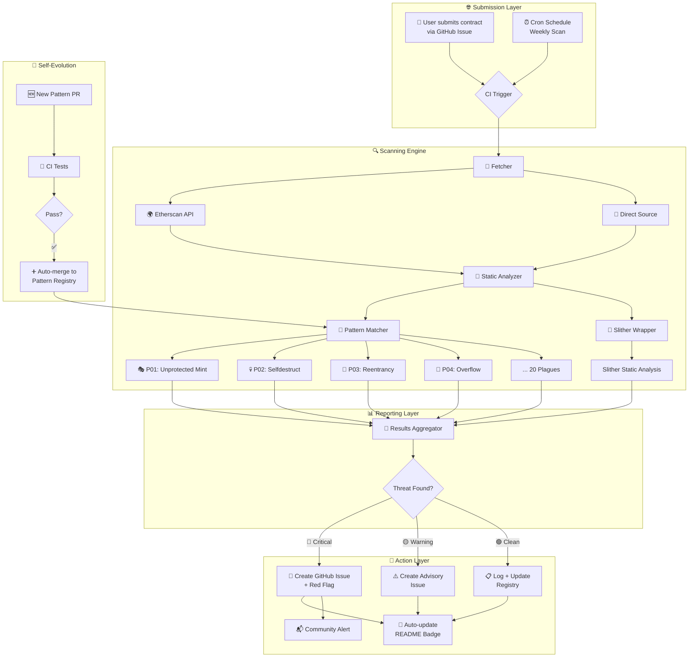

# 👁️⚖️ MaatEye — The Eternal Guardian of Smart Contracts

<p align="center">
  
  
  
  
  
  
</p>

<p align="center">
  <b>🏛️ Named after Ma'at (ماعت)</b> — the ancient Egyptian goddess of truth, balance, and justice.<br>
  <i>"She who weighs the heart against the feather."</i>
</p>

---

## 🚀 Vision

**MaatEye** is an open-source, community-driven **smart contract vulnerability scanner** that automatically detects **20+ dangerous patterns** in Ethereum contracts. It runs on **GitHub Actions**, updates itself, and maintains a **live Red Flag registry** of vulnerable contracts.

> Not a pentest tool. Not an exploit kit.  
> **A guardian that watches, warns, and protects.**

### What makes MaatEye different?

| Feature | MaatEye | Others |
|---------|---------|--------|
| 🆓 **Free** (runs on GitHub Actions) | ✅ | ❌ Paid APIs |
| 🔄 **Self-updating** | ✅ New patterns auto-deploy | ❌ Manual updates |
| 🚩 **Live Red Flag registry** | ✅ Public GitHub Issues | ❌ Private DB |
| 🧩 **Community patterns** | ✅ Anyone can PR a pattern | ❌ Closed source |
| 🔍 **Source code analysis** | ✅ Regex + AST + Slither | ❌ Signature-only |
| 📬 **Submit a contract** | ✅ Open an Issue | ❌ Email form |

---

## 📋 The 20 Plagues — Detection Patterns

> *"I will bring the plagues upon the unsafe contracts, and they shall be exposed."*

| # | Pattern | Severity | Detection |
|---|---------|----------|-----------|
| 🎭 | **P01 — Unprotected Mint** | 🔴 Critical | Anyone can mint tokens |
| 💀 | **P02 — Selfdestruct Anyone** | 🔴 Critical | Anyone can kill the contract |
| 🔄 | **P03 — Reentrancy** | 🔴 Critical | Unsafe external calls before state update |
| 📐 | **P04 — Integer Overflow/Underflow** | 🔴 Critical | Arithmetic without SafeMath/checked math |
| 🚪 | **P05 — tx.origin Authentication** | 🟡 High | Phishing-vulnerable auth pattern |
| 📞 | **P06 — Unchecked Call** | 🟡 High | Call without return value check |
| 🎪 | **P07 — Delegatecall Injection** | 🔴 Critical | Arbitrary delegatecall target |
| 🗂️ | **P08 — Storage Collision** | 🟡 High | Proxy storage layout mismatch |
| 🎯 | **P09 — No Input Validation** | 🟡 High | Unbounded loops, unvalidated params |
| 🏷️ | **P10 — Oracle Manipulation** | 🔴 Critical | Price feed without manipulation checks |
| 💧 | **P11 — Flash Loan Attack Vector** | 🟡 High | Susceptible to flash loan price manipulation |
| ✍️ | **P12 — Signature Replay** | 🟡 High | EIP-712 without nonce/chainId |
| 🗳️ | **P13 — Governance Attack** | 🔴 Critical | Low quorum, vote manipulation |
| 👑 | **P14 — Ownership Renounce (Unsafe)** | 🟡 Medium | Renounce without timelock/backup |
| 🔍 | **P15 — Incorrect Visibility** | 🟡 Medium | Internal functions exposed as public |
| 🍼 | **P16 — Uninitialized Proxy** | 🔴 Critical | Proxy without initialization guard |
| 🎪 | **P17 — Arbitrary External Call** | 🔴 Critical | Unrestricted external call destination |
| 🚫 | **P18 — Missing Access Control** | 🟡 High | Critical functions without onlyOwner |
| 🛡️ | **P19 — No SafeERC20** | 🟡 Medium | Direct transfer without return check |
| ⏰ | **P20 — Timestamp Dependence** | 🟡 Medium | `block.timestamp` for critical logic |

---

## 🏗️ Architecture



### Data Flow

```
User/Time Trigger
       │
       ▼
┌─────────────────┐     ┌─────────────────┐     ┌──────────────────┐
│  Fetch Contract  │────▶│  Run All 20     │────▶│  Aggregate       │
│  Source + ABI    │     │  Pattern Checks  │     │  Results         │
└─────────────────┘     └─────────────────┘     └──────────────────┘
                                                       │
                                                       ▼
┌─────────────────┐     ┌─────────────────┐     ┌──────────────────┐
│  Update README  │◀────│  Create Issue    │◀────│  Classify        │
│  + Registry     │     │  (if vuln found) │     │  Severity        │
└─────────────────┘     └─────────────────┘     └──────────────────┘
```

---

## 🚦 Quick Start

### 1. Submit a Contract for Scanning

Open a [Contract Submission Issue](https://github.com/Lord1Egypt/MaatEye/issues/new?template=submit_contract.yml) with the contract address.

### 2. Run Locally

```bash
# Clone
git clone https://github.com/Lord1Egypt/MaatEye.git
cd MaatEye

# Install
pip install -r requirements.txt

# Scan a contract
python -m scanner.main scan --address 0x742d35Cc6634C0532925a3b844Bc9e7595f2bD18

# Scan multiple
python -m scanner.main scan --file contracts.txt

# All patterns, JSON output
python -m scanner.main scan --address 0x... --format json --output report.json
```

### 3. Scan a Specific Chain

```bash
# List all supported chains
python -m scanner.main chains

# Scan top 10 tokens on BNB Chain
python -m scanner.main scan-chain bnb --count 10 --format markdown

# Scan top 10 tokens on ALL 24 EVM chains
python -m scanner.main scan-all --tokens-per-chain 10 --format json --output cross_chain.json
```

### 4. Custom Patterns

```bash
# Add a custom pattern
python -m scanner.main patterns add my_pattern.yaml

# List all patterns
python -m scanner.main patterns list
```

---

## 🌐 Supported Chains (24 EVM)

MaatEye scans **24 EVM-compatible blockchains** using free public RPC endpoints from [publicnode.com](https://publicnode.com).

| # | Chain | Chain ID | Token | Discovered Tokens |
|---|-------|----------|-------|-------------------|
| 🔵 | **Ethereum** | 1 | ETH | 30 |
| 🟡 | **BNB Chain** | 56 | BNB | 20 |
| 🟣 | **Polygon** | 137 | MATIC | 20 |
| 🔷 | **Base** | 8453 | ETH | 20 |
| 🌀 | **Arbitrum One** | 42161 | ETH | 20 |
| 🔴 | **Optimism** | 10 | ETH | 20 |
| 🔺 | **Avalanche C-Chain** | 43114 | AVAX | 20 |
| ⬛ | **Linea** | 59144 | ETH | 15 |
| 📜 | **Scroll** | 534352 | ETH | 15 |
| 💥 | **Blast** | 81457 | ETH | 15 |
| 🦉 | **Gnosis** | 100 | xDAI | 15 |
| 🌿 | **Celo** | 42220 | CELO | 15 |
| 🌕 | **Moonbeam** | 1284 | GLMR | 15 |
| 🏛 | **Metis** | 1088 | METIS | 15 |
| 🟨 | **opBNB** | 204 | BNB | 10 |
| 💓 | **PulseChain** | 369 | PLS | 10 |
| ⚙️ | **Mantle** | 5000 | MNT | 10 |
| 🥁 | **Taiko** | 167000 | ETH | 10 |
| 🐻 | **Berachain** | 80094 | BERA | 10 |
| 🌊 | **Soneium** | 1868 | ETH | 10 |
| 🦄 | **Unichain** | 130 | ETH | 10 |
| ⬜ | **Fraxtal** | 252 | frxETH | 10 |
| 🌶 | **Chiliz** | 88888 | CHZ | 10 |
| ⚡ | **Sonic** | 146 | S | 10 |

**Total: 24 EVM chains, ~350+ tokens scanned daily**

> 🔒 **RPC endpoints from [publicnode.com](https://publicnode.com)** — free, no API key required, rate-limited respectfully.
> 
> ⚠️ **All scanning is READ-ONLY static analysis** — we never send transactions, never deploy, never exploit.

---

## 🧪 Project Status

| Milestone | Status | ETA |
|-----------|--------|-----|
| 🏗️ Repo Structure & CI/CD | ✅ Done | v0.1 |
| 🔴 20 Plagues Patterns | ✅ Done | v0.2 |
| 🌐 24 EVM Chains Support | ✅ Done | v0.3 |
| 📅 Daily Cross-Chain Scan | ✅ Done | v0.3 |
| 🚩 Auto Red Flag Issues | ✅ Done | v0.2 |
| 🔬 Slither Integration | 🔄 In Progress | v0.4 |
| 🌉 Non-EVM Chains (Solana, BTC, etc.) | 📅 Planned | v0.5 |
| 🤖 Auto-Fix Suggestions | 📅 Planned | v0.6 |
| 📊 Live Vulnerability Dashboard | 📅 Planned | v0.7 |
| 🧠 ML Pattern Detection | 📅 Planned | v1.0 |

---

## 🤝 How to Contribute

We welcome contributions of all kinds!

- **🐛 Report a Bug** — [Open an issue](https://github.com/Lord1Egypt/MaatEye/issues/new?template=bug_report.yml)
- **✨ New Pattern** — [Submit a pattern PR](https://github.com/Lord1Egypt/MaatEye/compare)
- **📖 Improve Docs** — Fix typos, add examples
- **🔬 Submit a Contract** — [Submit for scan](https://github.com/Lord1Egypt/MaatEye/issues/new?template=submit_contract.yml)
- **🚩 Report Vulnerability** — [Responsible disclosure](https://github.com/Lord1Egypt/MaatEye/issues/new?template=vulnerability_report.yml)

See [CONTRIBUTING.md](CONTRIBUTING.md) for full guidelines.

---

## 📜 License

MIT — Free for everyone. Open source. Community-owned.

---

## ⚠️ Disclaimer

**MaatEye is for defensive/educational purposes only.** It analyzes publicly available contract source code and identifies potential vulnerabilities. Users are responsible for complying with all applicable laws and regulations. The authors are not liable for misuse.

---

## 🏛️ The Philosophy of Ma'at

> *"I have not done that which the gods abhor.  
> I have not caused wrong to be done to the people.  
> I have not wrought evil.  
> I have not deprived the humble man of his property.  
> I have not done that which is an abomination to the gods.  
> I have not caused harm to be done to the servant by his master.  
> I have not caused pain.  
> I have not caused tears.  
> I have not slain.  
> I have not commanded to slay."*
>
> — **The Negative Confession**, Book of the Dead

---

<p align="center">
  Made with ❤️ and 🔥 by <b>Lord1Egypt</b><br>
  <i>⚖️ May your contracts be balanced on the feather of Ma'at ⚖️</i>
</p>
